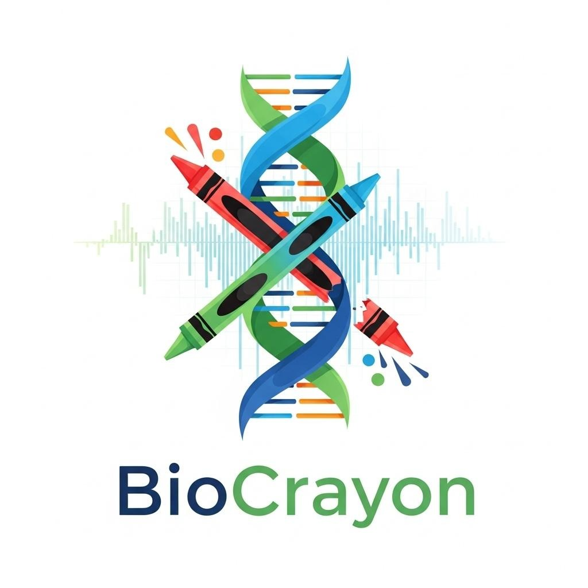

bio-crayon Documentation
========================

A Python package for biological data visualization with custom colormaps.

.. toctree::
   :maxdepth: 2
   :caption: Contents:

   installation
   quickstart
   api
   examples
   contributing

Indices and tables
==================

* :ref:`genindex`
* :ref:`modindex`
* :ref:`search`
